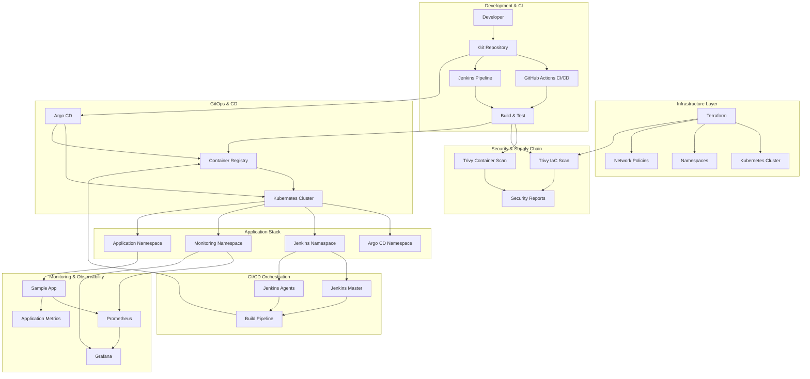
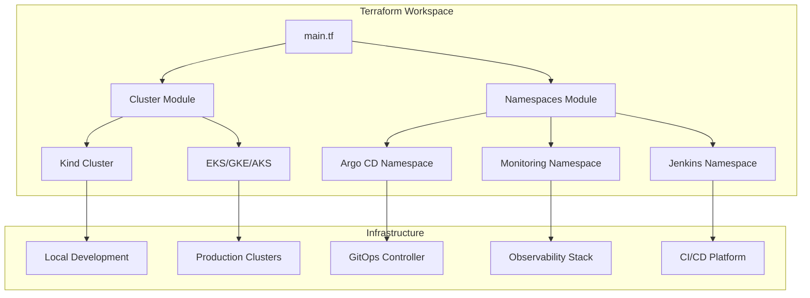

# DevOps Reference Project

A complete, production-ready DevOps reference project demonstrating modern tools and best practices for Kubernetes-based deployments.

## 🏗️ Architecture Overview



## 🛠️ Technology Stack

| Category | Tool | Version | Purpose |
|----------|------|---------|---------|
| **Infrastructure as Code** | Terraform | >=1.5.0 | Infrastructure provisioning and management |
| **GitOps & CD** | Argo CD | v2.8.0+ | Git-based continuous delivery |
| **CI/CD** | GitHub Actions | Latest | Automated pipelines (Option A) |
| **CI/CD** | Jenkins | LTS | Self-hosted CI/CD platform (Option B) |
| **Security** | Trivy | v0.45.0+ | Container & IaC vulnerability scanning |
| **Monitoring** | Prometheus | v2.45.0+ | Metrics collection and storage |
| **Observability** | Grafana | v10.0.0+ | Data visualization and dashboards |
| **Container Runtime** | Docker | Latest | Container building and management |
| **Container Registry** | Any | - | Container image storage |
| **Kubernetes** | Kind/EKS/GKE/AKS | 1.25+ | Container orchestration platform |
| **Local Development** | Kind | v0.20+ | Local Kubernetes cluster |

## 📋 Prerequisites

### System Requirements
- **OS**: Linux, macOS, or Windows with WSL2
- **Memory**: Minimum 8GB RAM (16GB recommended)
- **Storage**: 10GB free disk space

### Required Tools
```bash
# Core tools
kubectl v1.25+          # Kubernetes CLI
docker v20.10+          # Container runtime
helm v3.12+             # Kubernetes package manager
git v2.30+              # Version control

# Infrastructure as Code
terraform >=1.5.0       # Infrastructure provisioning
kind v0.20+             # Local Kubernetes cluster

# CI/CD & GitOps
argocd v2.8.0+          # Argo CD CLI
trivy v0.45.0+          # Security scanner

# Optional: Jenkins CLI
jenkins-cli             # Jenkins command line interface
```

### Installation Commands

#### Ubuntu/Debian
```bash
# kubectl
curl -LO "https://dl.k8s.io/release/$(curl -L -s https://dl.k8s.io/release/stable.txt)/bin/linux/amd64/kubectl"
sudo install -o root -g root -m 0755 kubectl /usr/local/bin/kubectl

# Docker
curl -fsSL https://get.docker.com -o get-docker.sh
sudo sh get-docker.sh
sudo usermod -aG docker $USER

# Helm
curl https://raw.githubusercontent.com/helm/helm/main/scripts/get-helm-3 | bash

# Terraform
wget -O- https://apt.releases.hashicorp.com/gpg | sudo gpg --dearmor -o /usr/share/keyrings/hashicorp-archive-keyring.gpg
echo "deb [signed-by=/usr/share/keyrings/hashicorp-archive-keyring.gpg] https://apt.releases.hashicorp.com $(lsb_release -cs) main" | sudo tee /etc/apt/sources.list.d/hashicorp.list
sudo apt-get update && sudo apt-get install terraform

# Kind
curl -Lo ./kind https://kind.sigs.k8s.io/dl/v0.20.0/kind-linux-amd64
chmod +x ./kind
sudo mv ./kind /usr/local/bin/kind

# Trivy
sudo apt-get install wget apt-transport-https gnupg lsb-release
wget -qO - https://aquasecurity.github.io/trivy-repo/deb/public.key | sudo apt-key add -
echo "deb https://aquasecurity.github.io/trivy-repo/deb $(lsb_release -sc) main" | sudo tee -a /etc/apt/sources.list.d/trivy.list
sudo apt-get update
sudo apt-get install trivy
```

#### macOS (using Homebrew)
```bash
brew install kubectl docker helm terraform kind trivy argocd
```

## 🏗️ Infrastructure Provisioning with Terraform

This project includes Terraform modules to provision and manage Kubernetes infrastructure across different environments and cloud providers.

### Terraform Architecture



### Terraform Configuration Structure

```
terraform/
├── main.tf                 # Main configuration with providers
├── variables.tf            # Input variables
├── outputs.tf              # Output values
├── terraform.tfstate       # State file (local by default)
├── modules/
│   ├── cluster/           # Kubernetes cluster provisioning
│   │   ├── main.tf
│   │   ├── variables.tf
│   │   └── outputs.tf
│   └── namespaces/       # Namespace and network policies
│       ├── main.tf
│       ├── variables.tf
│       └── outputs.tf
├── environments/
│   ├── dev/              # Development environment
│   └── prod/             # Production environment
└── scripts/              # Helper scripts
```

### Supported Cluster Types

#### 1. Kind Cluster (Local Development)
Ideal for local development and testing:
```bash
# Configure for Kind
export TF_VAR_cluster_type="kind"
export TF_VAR_cluster_name="devops-ref-local"

# Initialize and apply
make terraform-init
make terraform-plan
make terraform-apply
```

#### 2. Managed Kubernetes Clusters
Production-ready managed clusters:

**Amazon EKS:**
```bash
export TF_VAR_cluster_type="eks"
export TF_VAR_cloud_provider="aws"
export TF_VAR_region="us-west-2"
export TF_VAR_node_count=3
export TF_VAR_node_type="t3.medium"
```

**Google GKE:**
```bash
export TF_VAR_cluster_type="gke"
export TF_VAR_cloud_provider="gcp"
export TF_VAR_region="us-central1"
```

**Azure AKS:**
```bash
export TF_VAR_cluster_type="aks"
export TF_VAR_cloud_provider="azure"
export TF_VAR_region="eastus"
```

### Terraform State Management

#### Local State (Default)
- Uses local file storage
- Suitable for development and single-user environments
- State file: `terraform/terraform.tfstate`

#### Remote State (Production)
Uncomment the remote backend configuration in `main.tf`:

**AWS S3 Backend:**
```hcl
backend "s3" {
  bucket         = "devops-ref-terraform-state"
  key            = "terraform.tfstate"
  region         = "us-west-2"
  encrypt        = true
  dynamodb_table = "terraform-locks"
}
```

### Step-by-Step Terraform Setup

#### 1. Prerequisites
```bash
# Install Terraform
curl -fsSL https://apt.releases.hashicorp.com/gpg | sudo apt-key add -
sudo apt-add-repository "deb [arch=amd64] https://apt.releases.hashicorp.com $(lsb_release -cs) main"
sudo apt-get update && sudo apt-get install terraform

# Verify installation
terraform version
```

#### 2. Configure Environment
```bash
# For local Kind cluster
export TF_VAR_cluster_type="kind"
export TF_VAR_cluster_name="devops-ref"

# For production EKS cluster
export TF_VAR_cluster_type="eks"
export TF_VAR_cloud_provider="aws"
export TF_VAR_region="us-west-2"
export TF_VAR_node_count=3
```

#### 3. Initialize Terraform
```bash
make terraform-init
# or
cd terraform && terraform init
```

#### 4. Plan Infrastructure Changes
```bash
make terraform-plan
# or
cd terraform && terraform plan
```

#### 5. Apply Infrastructure
```bash
make terraform-apply
# or
cd terraform && terraform apply -auto-approve
```

#### 6. Verify Cluster Access
```bash
# Get cluster information
terraform output

# Test cluster access
kubectl cluster-info
kubectl get nodes
```

### Terraform Modules

#### Cluster Module (`modules/cluster/`)
Creates and configures Kubernetes clusters:
- **Kind**: Local Docker-based cluster
- **EKS**: Amazon EKS with managed node groups
- **GKE**: Google Kubernetes Engine
- **AKS**: Azure Kubernetes Service

Features:
- Automatic port mapping for local development
- Network configuration
- Node provisioning and scaling
- Cluster lifecycle management

#### Namespaces Module (`modules/namespaces/`)
Manages Kubernetes namespaces and security policies:
- Namespace creation with labels and annotations
- Network policies (default deny, allow DNS)
- Resource quota configuration
- Security context constraints

### Environment-Specific Configurations

#### Development Environment (`environments/dev/`)
```bash
# Use for local development
terraform apply -var-file="environments/dev/terraform.tfvars"
```

#### Production Environment (`environments/prod/`)
```bash
# Use for production deployments
terraform apply -var-file="environments/prod/terraform.tfvars"
```

### Best Practices

1. **State Management**: Always use remote state for production
2. **Version Control**: Store `.tfvars` files securely (never commit secrets)
3. **Resource Naming**: Use consistent naming conventions
4. **Modular Design**: Keep modules focused and reusable
5. **Planning**: Always run `terraform plan` before applying
6. **Validation**: Use `terraform validate` and `terraform fmt`

### Troubleshooting Terraform

#### Common Issues

1. **Cluster Creation Fails**
```bash
# Check Kind installation
kind version

# Check Docker daemon
docker version

# Validate cluster configuration
terraform validate
```

2. **State Lock Issues**
```bash
# Force unlock if necessary
terraform force-unlock LOCK_ID
```

3. **Provider Configuration**
```bash
# Reinitialize providers
terraform init -upgrade
```

## 🔄 CI Options: GitHub Actions vs Jenkins

This project supports both GitHub Actions and Jenkins as CI systems, allowing you to choose based on your organization's requirements and preferences.

### Architecture Comparison

```mermaid
graph TB
    subgraph "GitHub Actions Flow"
        A1[Developer Push] --> B1[GitHub Actions Runner]
        B1 --> C1[Build & Test]
        C1 --> D1[Security Scan]
        D1 --> E1[Push to Registry]
        E1 --> F1[Update GitOps Repo]
        F1 --> G1[Argo CD Deploy]
    end
    
    subgraph "Jenkins Flow"
        A2[Developer Push] --> B2[Jenkins Webhook]
        B2 --> C2[Jenkins Agent Pod]
        C2 --> D2[Build & Test]
        D2 --> E2[Security Scan]
        E2 --> F2[Push to Registry]
        F2 --> G2[Update GitOps Repo]
        G2 --> H2[Argo CD Deploy]
    end
```



### Feature Comparison

| Feature | GitHub Actions | Jenkins | Recommendation |
|---------|---------------|---------|----------------|
| **Setup Complexity** | ✅ Low | ⚠️ Medium | GitHub Actions for quick start |
| **Self-Hosted Options** | ✅ Yes | ✅ Yes | Both support self-hosted |
| **Pipeline as Code** | ✅ YAML | ✅ Jenkinsfile | Both excellent |
| **Plugin Ecosystem** | ✅ Marketplace | ✅ Massive | Jenkins has more mature plugins |
| **Cost Model** | ⚠️ Usage-based | ✅ Self-managed | Jenkins for predictable costs |
| **Integration** | ✅ Native GitHub | ⚠️ Requires setup | GitHub Actions seamless |
| **Scalability** | ✅ Auto-scaling | ⚠️ Manual scaling | GitHub Actions easier |
| **Security** | ✅ GitHub-managed | ✅ Self-controlled | Based on security requirements |
| **Custom Environments** | ⚠️ Limited | ✅ Full control | Jenkins for custom needs |

### When to Use GitHub Actions

**Choose GitHub Actions when:**
- You want simple, quick setup
- Your team is already using GitHub
- You need easy integration with GitHub ecosystem
- You prefer usage-based pricing model
- You don't have complex custom requirements

**Advantages:**
- Native GitHub integration
- No infrastructure to manage
- Easy to get started
- Great for open source projects
- Seamless authentication with GitHub

**Limitations:**
- Limited control over runners
- Usage costs can be unpredictable
- Fewer customization options
- Dependency on GitHub platform

### When to Use Jenkins

**Choose Jenkins when:**
- You need full control over build environment
- You have complex custom requirements
- You need predictable costs
- You have existing Jenkins expertise
- You require extensive plugin ecosystem

**Advantages:**
- Complete control over infrastructure
- Massive plugin ecosystem
- Predictable costs
- Highly customizable
- Mature and battle-tested
- Works with any VCS

**Considerations:**
- Requires infrastructure management
- More complex setup and maintenance
- Need to manage updates and security
- Requires Jenkins expertise

### Quick Setup Comparison

#### GitHub Actions Setup
```bash
# 1. Configure GitHub Secrets
# - DOCKER_REGISTRY
# - KUBE_CONFIG
# - ARGOCD_SERVER
# - ARGOCD_USERNAME
# - ARGOCD_PASSWORD

# 2. Push to trigger workflow
git push origin main
```

#### Jenkins Setup
```bash
# 1. Deploy Jenkins to Kubernetes
make jenkins-deploy

# 2. Configure Jenkins credentials
# - docker-registry
# - github-token
# - slack-webhook

# 3. Create pipeline job
# - Point to Jenkinsfile
# - Configure webhooks
```

### Migration Guide

#### From GitHub Actions to Jenkins

1. **Infrastructure Setup:**
```bash
# Deploy Jenkins
make jenkins-deploy

# Verify access
make jenkins-access
```

2. **Pipeline Migration:**
```bash
# Copy Jenkinsfile to repository root
# Configure jenkins-agent.yaml
# Update credentials in Jenkins
```

3. **Webhook Configuration:**
```bash
# Configure GitHub webhook to Jenkins
# Update pipeline triggers
# Test integration
```

#### From Jenkins to GitHub Actions

1. **Repository Configuration:**
```bash
# Create .github/workflows/ci-cd.yml
# Configure GitHub Secrets
# Remove Jenkins files
```

2. **Pipeline Conversion:**
```bash
# Convert Jenkinsfile stages to GitHub Actions
# Update security scanning steps
# Test new workflow
```

### Best Practices

#### GitHub Actions Best Practices
- Use matrix builds for multiple environments
- Implement caching for faster builds
- Use GitHub Actions secrets for sensitive data
- Leverage composite actions for reusability
- Monitor usage and optimize workflows

#### Jenkins Best Practices
- Use Configuration as Code (JCasC)
- Implement proper backup strategies
- Use Jenkins agents for isolation
- Monitor resource usage
- Keep plugins updated
- Implement proper security measures

### Security Considerations

#### GitHub Actions Security
- ✅ GitHub manages runner security
- ✅ Automatic updates
- ⚠️ Review third-party actions
- ✅ Secure secrets management

#### Jenkins Security
- ✅ Full control over security
- ⚠️ Responsible for updates
- ✅ Custom security policies
- ⚠️ Need to secure Jenkins master

### Cost Analysis

#### GitHub Actions Costs
```yaml
# Approximate monthly costs (USD)
# Free tier: 2,000 minutes/month
# Beyond free tier: $0.008/minute (Linux)
# Example: 500 builds × 10 minutes = $40/month
```

#### Jenkins Costs
```yaml
# Infrastructure costs (approximate)
# Small instance: $50/month
# Medium instance: $150/month
# Storage: $20/month
# Total: $70-$170/month (predictable)
```

### Recommendation Framework

| Factor | Weight | GitHub Actions | Jenkins |
|--------|--------|----------------|---------|
| Setup Speed | 20% | 9/10 | 6/10 |
| Cost Predictability | 15% | 6/10 | 9/10 |
| Customization | 20% | 7/10 | 10/10 |
| Integration | 15% | 10/10 | 7/10 |
| Scalability | 15% | 9/10 | 7/10 |
| Security Control | 15% | 7/10 | 9/10 |

**Score:** GitHub Actions: 8.0/10, Jenkins: 8.0/10

**Decision Matrix:**
- **Small teams/projects**: GitHub Actions
- **Enterprise with complex needs**: Jenkins
- **GitHub-centric workflow**: GitHub Actions
- **Multi-VCS environments**: Jenkins
- **Cost-sensitive scaling**: Jenkins
- **Rapid prototyping**: GitHub Actions

## 🚀 Quick Start

Choose your preferred setup approach:

### Option A: Complete Terraform + Jenkins Setup (Recommended for Production)

#### 1. Clone the Repository
```bash
git clone https://github.com/your-org/devops-reference-project.git
cd devops-reference-project
```

#### 2. Provision Infrastructure with Terraform
```bash
# For local development
export TF_VAR_cluster_type="kind"

# Initialize Terraform
make terraform-init

# Plan and apply infrastructure
make terraform-plan
make terraform-apply
```

#### 3. Deploy Jenkins (Alternative CI System)
```bash
# Deploy Jenkins to Kubernetes
make jenkins-deploy

# Verify Jenkins is running
make jenkins-access
```

#### 4. Deploy GitOps Stack
```bash
# Deploy Argo CD and monitoring
make setup
```

#### 5. Configure Jenkins Pipeline
```bash
# Access Jenkins at http://localhost:8080
# Username: admin, Password: admin123
# Create pipeline job pointing to Jenkinsfile
# Configure credentials for registry and Git
```

### Option B: GitHub Actions + Manual Cluster Setup (Quick Start)

#### 1. Clone the Repository
```bash
git clone https://github.com/your-org/devops-reference-project.git
cd devops-reference-project
```

#### 2. Set Up Kubernetes Cluster
```bash
# Using kind (local development)
kind create cluster --name devops-ref

# Or use your existing cluster
kubectl cluster-info
```

#### 3. Initialize the DevOps Stack
```bash
# Automated setup
make setup

# Or run manually
./scripts/setup.sh
```

#### 4. Configure GitHub Actions
```bash
# Set up GitHub Secrets:
# - DOCKER_REGISTRY
# - KUBE_CONFIG
# - ARGOCD_SERVER
# - ARGOCD_USERNAME
# - ARGOCD_PASSWORD
```

### Option C: Hybrid Setup (Terraform + GitHub Actions)

#### 1. Clone and Setup Infrastructure
```bash
git clone https://github.com/your-org/devops-reference-project.git
cd devops-reference-project

# Use Terraform for infrastructure
make terraform-init
make terraform-plan
make terraform-apply
```

#### 2. Deploy DevOps Stack
```bash
make setup
```

#### 3. Use GitHub Actions for CI
Configure GitHub secrets as in Option B

### 4. Verify Installation
```bash
# Check all pods are running
kubectl get pods -A

# Access services
make access-info

# For Jenkins setup
make jenkins-access
```

### 5. First Deployment Test

#### Using GitHub Actions:
```bash
# Push to trigger pipeline
git add .
git commit -m "Initial setup"
git push origin main
```

#### Using Jenkins:
```bash
# Trigger Jenkins job manually or via webhook
# Jenkins will automatically build and update GitOps manifests
```

### Architecture Decision Guide

| Setup Type | Best For | CI System | Infrastructure | Complexity |
|------------|----------|-----------|----------------|------------|
| Option A | Production, Self-hosted | Jenkins | Terraform | High |
| Option B | Development, Quick start | GitHub Actions | Manual | Low |
| Option C | Production, Managed CI | GitHub Actions | Terraform | Medium |

Choose the option that best fits your team's expertise and requirements.

## 📖 Detailed Setup Instructions

### Step 1: Kubernetes Cluster Setup

#### Option A: Local Cluster (Recommended for Development)
```bash
# Create kind cluster with extra ports
cat > kind-config.yaml << EOF
kind: Cluster
apiVersion: kind.x-k8s.io/v1alpha4
nodes:
- role: control-plane
  kubeadmConfigPatches:
  - |
    kind: InitConfiguration
    nodeRegistration:
      kubeletExtraArgs:
        node-labels: "ingress-ready=true"
  extraPortMappings:
  - containerPort: 80
    hostPort: 80
    protocol: TCP
  - containerPort: 443
    hostPort: 443
    protocol: TCP
EOF

kind create cluster --config kind-config.yaml --name devops-ref
```

#### Option B: Managed Cluster
```bash
# AWS EKS
aws eks update-kubeconfig --region us-west-2 --name my-cluster

# Google GKE
gcloud container clusters get-credentials my-cluster --zone us-central1-a

# Azure AKS
az aks get-credentials --resource-group myResourceGroup --name myAKSCluster
```

### Step 2: Install Argo CD

#### Method 1: Automated Installation
```bash
kubectl apply -n argocd -f https://raw.githubusercontent.com/argoproj/argo-cd/stable/manifests/install.yaml

# Configure access
kubectl patch svc argocd-server -n argocd -p '{"spec":{"type":"LoadBalancer"}}'
```

#### Method 2: Using Helm
```bash
helm repo add argo https://argoproj.github.io/argo-helm
helm install argocd argo/argo-cd --namespace argocd --create-namespace
```

### Step 3: Deploy Applications via GitOps

```bash
# Create Argo CD application
kubectl apply -f manifests/argocd/sample-app.yaml

# Sync application
argocd app sync sample-app

# Monitor deployment
argocd app get sample-app
```

### Step 4: Install Monitoring Stack

```bash
# Install Prometheus
kubectl apply -f manifests/prometheus/

# Install Grafana
kubectl apply -f manifests/grafana/

# Verify installation
kubectl get pods -n monitoring
```

### Step 5: Run Security Scans

#### Container Scanning
```bash
# Build your image
docker build -t sample-app:latest apps/sample-app/

# Run container scan
./scripts/trivy-container-scan.sh sample-app:latest
```

#### IaC Scanning
```bash
# Scan all Kubernetes manifests
./scripts/trivy-iac-scan.sh

# Or scan specific directory
trivy config manifests/
```

## 🔧 Configuration Details

### Argo CD Configuration

The Argo CD configuration is located in `manifests/argocd/`:

- `argocd-config.yaml`: Basic Argo CD configuration
- `sample-app.yaml`: GitOps application definition
- `argocd-service.yaml`: Service configuration for external access

### Prometheus Configuration

Key configuration files:
- `manifests/prometheus/configmap.yaml`: Prometheus configuration
- `manifests/prometheus/deployment.yaml`: Deployment spec
- `manifests/prometheus/service.yaml`: Service definition

**Important Metrics Scraped:**
- Application metrics (port 3000/metrics)
- Kubernetes API server
- Node metrics (cAdvisor)
- Prometheus self-monitoring

### Grafana Configuration

- `manifests/grafana/deployment.yaml`: Grafana deployment
- `manifests/grafana/configmap.yaml`: Prometheus datasource configuration
- `manifests/grafana/dashboard-provider.yaml`: Dashboard provider configuration

**Default Credentials:**
- Username: `admin`
- Password: `admin123`

### Trivy Configuration

Trivy operator deployment in `manifests/trivy/trivy-operator.yaml`:
- Scans running containers for vulnerabilities
- Generates security reports
- Integrates with Kubernetes admission controllers

## 📊 Access Information

After successful deployment:

### Argo CD
```bash
# Get password
kubectl get secret argocd-initial-admin-secret -n argocd -o jsonpath='{.data.password}' | base64 -d

# Get URL
kubectl get svc argocd-server -n argocd
```

### Jenkins (Alternative CI System)
```bash
# Check Jenkins status
kubectl get pods -n jenkins -l app.kubernetes.io/name=jenkins

# Port forward for local access
kubectl port-forward svc/jenkins-service 8080:8080 -n jenkins

# Access in browser
open http://localhost:8080

# Default credentials
# Username: admin
# Password: admin123

# Alternative: Get service URL for LoadBalancer
kubectl get svc jenkins-service -n jenkins
```

### Grafana
```bash
# Port forward
kubectl port-forward svc/grafana-service 3000:3000 -n monitoring

# Access in browser
open http://localhost:3000
# Username: admin / Password: admin123
```

### Prometheus
```bash
# Port forward
kubectl port-forward svc/prometheus-service 9090:9090 -n monitoring

# Access in browser
open http://localhost:9090
```

### Sample Application
```bash
# Port forward
kubectl port-forward svc/sample-app-service 8080:80

# Access API
curl http://localhost:8080/
curl http://localhost:8080/health
curl http://localhost:8080/metrics
```

## 🧪 Verification Steps

### 1. Health Checks
```bash
# Check all deployments
kubectl get deployments -A

# Check pod status
kubectl get pods -A

# Check services
kubectl get svc -A
```

### 2. Application Testing
```bash
# Test sample application
curl http://localhost:8080/
curl http://localhost:8080/health

# Test metrics endpoint
curl http://localhost:8080/metrics
```

### 3. Monitoring Verification
```bash
# Check Prometheus targets
curl http://localhost:9090/api/v1/targets

# Verify metrics are being collected
curl -s "http://localhost:9090/api/v1/query?query=up"
```

### 4. Security Validation
```bash
# Run comprehensive security scan
make scan

# Check reports
ls -la security-reports/
```

## 🔍 Troubleshooting

### Common Issues and Solutions

#### 1. Pod Pending State
```bash
# Check pod events
kubectl describe pod <pod-name> -n <namespace>

# Common causes:
# - Insufficient resources
# - Image pull issues
# - Node taints/tolerations
```

#### 2. Service Not Accessible
```bash
# Check service endpoints
kubectl get endpoints <service-name> -n <namespace>

# Verify pod is running and ready
kubectl get pods -l app=<app-label> -n <namespace>
```

#### 3. Argo CD Sync Issues
```bash
# Check application status
argocd app get <app-name>

# Check application events
argocd app logs <app-name>

# Manual sync
argocd app sync <app-name> --force
```

#### 4. Prometheus Not Scraping Metrics
```bash
# Check Prometheus configuration
kubectl get configmap prometheus-config -n monitoring -o yaml

# Check Prometheus logs
kubectl logs deployment/prometheus -n monitoring

# Verify target endpoints
curl http://<target-service>:<port>/metrics
```

#### 5. Trivy Scan Failures
```bash
# Check Trivy operator logs
kubectl logs deployment/trivy-operator -n trivy-system

# Manually run Trivy scan
trivy image <image-name>
```

### Resource Requirements

If you encounter resource issues, ensure your cluster meets these minimum requirements:

```yaml
# Resource requests for main components
apiVersion: v1
kind: LimitRange
metadata:
  name: devops-ref-limits
spec:
  limits:
  - default:
      cpu: "500m"
      memory: "512Mi"
    defaultRequest:
      cpu: "100m"
      memory: "128Mi"
    type: Container
```

## 🔄 GitOps Workflow

### Development Workflow

#### Using GitHub Actions
1. **Development**: Make changes in feature branches
2. **Testing**: GitHub Actions runs tests and security scans
3. **Merge to develop**: Auto-deployment to staging
4. **Merge to main**: Production deployment via Argo CD

#### Using Jenkins
1. **Development**: Make changes in feature branches
2. **Testing**: Jenkins pipeline runs tests and security scans
3. **GitOps Update**: Jenkins updates deployment manifests
4. **Argo CD Sync**: Argo CD detects changes and deploys

### Branch Strategy
- `main`: Production-ready code
- `develop`: Staging environment
- `feature/*`: Feature development
- `hotfix/*`: Emergency fixes

### Deployment Promotion

#### GitHub Actions Workflow
```bash
# Promote from staging to production
git checkout main
git merge develop
git push origin main

# GitHub Actions automatically updates manifests
# Argo CD automatically syncs to production
argocd app sync sample-app --revision main
```

#### Jenkins Workflow
```bash
# Promote from staging to production
git checkout main
git merge develop
git push origin main

# Jenkins automatically:
# 1. Builds and tests application
# 2. Updates deployment manifests with new image tag
# 3. Commits and pushes changes to GitOps repo
# 4. Argo CD detects changes and deploys
```

### CI/CD Integration Points

#### GitHub Actions Integration
- Triggered by GitHub webhooks
- Updates deployment manifests automatically
- Uses GitHub Actions secrets for authentication
- Slack notifications via GitHub Actions

#### Jenkins Integration
- Triggered by GitHub webhooks or manually
- Updates GitOps repository with image tags
- Uses Jenkins credentials for authentication
- Slack notifications via Jenkins plugins

## 📈 Monitoring and Alerting

### Key Metrics to Monitor

#### Application Metrics
- `http_request_duration_seconds`: Request latency
- `http_requests_total`: Request count
- `process_cpu_seconds_total`: CPU usage
- `process_resident_memory_bytes`: Memory usage

#### Kubernetes Metrics
- Node CPU and memory utilization
- Pod restart counts
- Resource quotas
- Network traffic

### Grafana Dashboards

Create these essential dashboards:

1. **Application Dashboard**
   - Request rate and latency
   - Error rates
   - Application health

2. **Infrastructure Dashboard**
   - Node resource usage
   - Pod resource consumption
   - Network I/O

3. **Security Dashboard**
   - Vulnerability counts
   - Security scan results
   - Compliance metrics

## 🔒 Security Best Practices

### Container Security
```dockerfile
# Use minimal base images
FROM node:18-alpine

# Run as non-root user
USER node

# Scan images before deployment
trivy image sample-app:latest
```

### Kubernetes Security
```yaml
# Security context
securityContext:
  runAsNonRoot: true
  runAsUser: 1000
  fsGroup: 1000
  capabilities:
    drop:
    - ALL
```

### Network Policies
```yaml
apiVersion: networking.k8s.io/v1
kind: NetworkPolicy
metadata:
  name: deny-all
spec:
  podSelector: {}
  policyTypes:
  - Ingress
  - Egress
```

## 🚀 Scaling and Performance

### Horizontal Pod Autoscaling
```yaml
apiVersion: autoscaling/v2
kind: HorizontalPodAutoscaler
metadata:
  name: sample-app-hpa
spec:
  scaleTargetRef:
    apiVersion: apps/v1
    kind: Deployment
    name: sample-app
  minReplicas: 2
  maxReplicas: 10
  metrics:
  - type: Resource
    resource:
      name: cpu
      target:
        type: Utilization
        averageUtilization: 70
```

### Resource Optimization
- Set appropriate resource requests and limits
- Use node affinity for workload distribution
- Implement pod disruption budgets
- Configure cluster autoscaling

## 🛠️ Advanced Configuration

### Custom Prometheus Rules
```yaml
groups:
- name: sample-app-alerts
  rules:
  - alert: HighErrorRate
    expr: rate(http_requests_total{status_code=~"5.."}[5m]) > 0.1
    for: 5m
    labels:
      severity: critical
    annotations:
      summary: "High error rate detected"
```

### Grafana Alerting
```json
{
  "dashboard": {
    "templating": {
      "list": [
        {
          "name": "application",
          "type": "query",
          "datasource": "Prometheus",
          "query": "label_values(up, job)"
        }
      ]
    }
  }
}
```

## 📚 Additional Resources

### Documentation
- [Terraform Documentation](https://www.terraform.io/docs/)
- [Jenkins Documentation](https://www.jenkins.io/doc/)
- [Argo CD Documentation](https://argo-cd.readthedocs.io/)
- [Prometheus Documentation](https://prometheus.io/docs/)
- [Grafana Documentation](https://grafana.com/docs/)
- [Trivy Documentation](https://aquasecurity.github.io/trivy/)
- [Kind Documentation](https://kind.sigs.k8s.io/)
- [Docker Documentation](https://docs.docker.com/)

### Best Practices
- [Terraform Best Practices](https://www.terraform.io/docs/language/index.html)
- [Jenkins Best Practices](https://www.jenkins.io/doc/book/using/using-best-practices/)
- [Kubernetes Best Practices](https://kubernetes.io/docs/concepts/configuration/overview/)
- [GitOps Patterns](https://www.weave.works/technologies/gitops/)
- [Container Security Best Practices](https://cheatsheetseries.owasp.org/cheatsheets/Docker_Security_Cheat_Sheet.html)
- [Infrastructure as Code Best Practices](https://docs.microsoft.com/en-us/azure/architecture/framework/devops/infrastructure-as-code)

### Community and Support
- [Terraform Community](https://discuss.hashicorp.com/c/terraform)
- [Jenkins Community](https://community.jenkins.io/)
- [Argo CD Community](https://github.com/argoproj/argo-cd/discussions)
- [Kubernetes Community](https://kubernetes.io/community/)

## 🤝 Contributing

1. Fork the repository
2. Create a feature branch
3. Make your changes
4. Run tests and security scans
5. Submit a pull request

## 📄 License

This project is licensed under the MIT License - see the [LICENSE](LICENSE) file for details.

## 📞 Support

For questions and support:
- Create an issue in the repository
- Check the troubleshooting section
- Review the documentation links provided

---

**Happy DevOps!** 🎉