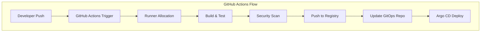
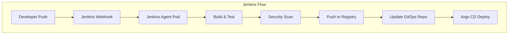

# CI/CD Comparison: GitHub Actions vs Jenkins

This document provides a detailed comparison between GitHub Actions and Jenkins for implementing CI/CD pipelines in this DevOps reference project.

## Architecture Overview

### GitHub Actions Flow


### Jenkins Flow


## Feature Comparison

| Feature | GitHub Actions | Jenkins | Recommendation |
|---------|---------------|---------|----------------|
| **Setup Complexity** | ✅ Low | ⚠️ Medium | GitHub Actions for quick start |
| **Self-Hosted Options** | ✅ Yes | ✅ Yes | Both support self-hosted |
| **Pipeline as Code** | ✅ YAML | ✅ Jenkinsfile | Both excellent |
| **Plugin Ecosystem** | ✅ Marketplace | ✅ Massive | Jenkins has more mature plugins |
| **Cost Model** | ⚠️ Usage-based | ✅ Self-managed | Jenkins for predictable costs |
| **Integration** | ✅ Native GitHub | ⚠️ Requires setup | GitHub Actions seamless |
| **Scalability** | ✅ Auto-scaling | ⚠️ Manual scaling | GitHub Actions easier |
| **Security** | ✅ GitHub-managed | ✅ Self-controlled | Based on security requirements |
| **Custom Environments** | ⚠️ Limited | ✅ Full control | Jenkins for custom needs |

## When to Use GitHub Actions

### Choose GitHub Actions when:
- You want simple, quick setup
- Your team is already using GitHub
- You need easy integration with GitHub ecosystem
- You prefer usage-based pricing model
- You don't have complex custom requirements

### Advantages:
- Native GitHub integration
- No infrastructure to manage
- Easy to get started
- Great for open source projects
- Seamless authentication with GitHub

### Limitations:
- Limited control over runners
- Usage costs can be unpredictable
- Fewer customization options
- Dependency on GitHub platform

## When to Use Jenkins

### Choose Jenkins when:
- You need full control over build environment
- You have complex custom requirements
- You need predictable costs
- You have existing Jenkins expertise
- You require extensive plugin ecosystem

### Advantages:
- Complete control over infrastructure
- Massive plugin ecosystem
- Predictable costs
- Highly customizable
- Mature and battle-tested
- Works with any VCS

### Considerations:
- Requires infrastructure management
- More complex setup and maintenance
- Need to manage updates and security
- Requires Jenkins expertise

## Quick Setup Comparison

### GitHub Actions Setup
```bash
# 1. Configure GitHub Secrets
# - DOCKER_REGISTRY
# - KUBE_CONFIG
# - ARGOCD_SERVER
# - ARGOCD_USERNAME
# - ARGOCD_PASSWORD

# 2. Push to trigger workflow
git push origin main
```

### Jenkins Setup
```bash
# 1. Deploy Jenkins to Kubernetes
make jenkins-deploy

# 2. Configure Jenkins credentials
# - docker-registry
# - github-token
# - slack-webhook

# 3. Create pipeline job
# - Point to Jenkinsfile
# - Configure webhooks
```

## Security Considerations

### GitHub Actions Security
- GitHub-managed runners with automatic updates
- Built-in secret management
- OIDC support for cloud authentication
- Granular permissions with GitHub Apps

### Jenkins Security
- Self-controlled security policies
- Custom security configurations
- Plugin vulnerability management
- Role-based access control

## Cost Analysis

### GitHub Actions Costs
- Free tier: 2,000 minutes/month for public repos
- Paid tier: Usage-based pricing
- Self-hosted runners: Infrastructure costs only
- Storage costs for artifacts

### Jenkins Costs
- Infrastructure costs (VMs, Kubernetes)
- Maintenance overhead
- Plugin development/support costs
- Predictable budgeting

## Migration Paths

### From Jenkins to GitHub Actions
1. Start with new pipelines in GitHub Actions
2. Gradually migrate existing jobs
3. Leverage GitHub Actions import tools
4. Maintain parallel systems during transition

### From GitHub Actions to Jenkins
1. Deploy Jenkins infrastructure
2. Convert workflows to Jenkinsfiles
3. Migrate secrets and credentials
4. Update webhook configurations

## Best Practices

### For Both Systems
- Use infrastructure as code
- Implement proper secret management
- Include comprehensive testing
- Monitor pipeline performance
- Use artifacts efficiently

### GitHub Actions Specific
- Use composite actions for reusability
- Leverage caching for performance
- Implement proper workflow triggers
- Use environments for deployment stages

### Jenkins Specific
- Use Jenkins shared libraries
- Implement proper agent configuration
- Use pipeline templates
- Monitor agent utilization