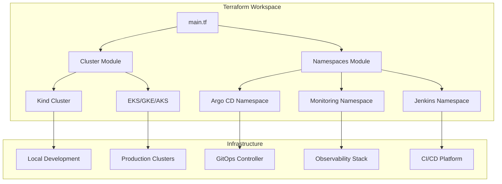

# Terraform Infrastructure as Code

This document provides detailed information about the Terraform configuration used in this DevOps reference project.

## Terraform Architecture



## Terraform Configuration Structure

```
terraform/
├── main.tf                 # Main configuration with providers
├── variables.tf            # Input variables
├── outputs.tf              # Output values
├── terraform.tfstate       # State file (local by default)
├── modules/
│   ├── cluster/           # Kubernetes cluster provisioning
│   │   ├── main.tf
│   │   ├── variables.tf
│   │   └── outputs.tf
│   └── namespaces/       # Namespace and network policies
│       ├── main.tf
│       ├── variables.tf
│       └── outputs.tf
├── environments/
│   ├── dev/              # Development environment
│   └── prod/             # Production environment
└── scripts/              # Helper scripts
```

## Supported Cluster Types

### 1. Kind Cluster (Local Development)
Ideal for local development and testing:
```bash
# Configure for Kind
export TF_VAR_cluster_type="kind"
export TF_VAR_cluster_name="devops-ref-local"

# Initialize and apply
make terraform-init
make terraform-plan
make terraform-apply
```

### 2. Managed Kubernetes Clusters
*Placeholder configurations - requires additional implementation for production use:*

**Amazon EKS:**
```bash
export TF_VAR_cluster_type="eks"
export TF_VAR_cloud_provider="aws"
export TF_VAR_region="us-west-2"
export TF_VAR_node_count=3
export TF_VAR_node_type="t3.medium"
```

**Google GKE:**
```bash
export TF_VAR_cluster_type="gke"
export TF_VAR_cloud_provider="gcp"
export TF_VAR_region="us-central1"
```

**Azure AKS:**
```bash
export TF_VAR_cluster_type="aks"
export TF_VAR_cloud_provider="azure"
export TF_VAR_region="eastus"
```

## Terraform State Management

### Local State (Default)
- Uses local file storage
- Suitable for development and single-user environments
- State file: `terraform/terraform.tfstate`

### Remote State (Production)
Uncomment the remote backend configuration in `main.tf`:

**AWS S3 Backend:**
```hcl
backend "s3" {
  bucket         = "devops-ref-terraform-state"
  key            = "terraform.tfstate"
  region         = "us-west-2"
  encrypt        = true
  dynamodb_table = "terraform-locks"
}
```

## Step-by-Step Terraform Setup

### 1. Prerequisites
```bash
# Install Terraform
curl -fsSL https://apt.releases.hashicorp.com/gpg | sudo apt-key add -
sudo apt-add-repository "deb [arch=amd64] https://apt.releases.hashicorp.com $(lsb_release -cs) main"
sudo apt-get update && sudo apt-get install terraform

# Verify installation
terraform version
```

### 2. Configure Environment
```bash
# For local Kind cluster
export TF_VAR_cluster_type="kind"
export TF_VAR_cluster_name="devops-ref"

# For production EKS cluster
export TF_VAR_cluster_type="eks"
export TF_VAR_cloud_provider="aws"
export TF_VAR_region="us-west-2"
export TF_VAR_node_count=3
```

### 3. Initialize Terraform
```bash
make terraform-init
# or
cd terraform && terraform init
```

### 4. Plan Infrastructure Changes
```bash
make terraform-plan
# or
cd terraform && terraform plan
```

### 5. Apply Infrastructure
```bash
make terraform-apply
# or
cd terraform && terraform apply -auto-approve
```

### 6. Verify Cluster Access
```bash
# Get cluster information
terraform output

# Test cluster access
kubectl cluster-info
kubectl get nodes
```

## Terraform Modules

### Cluster Module (`modules/cluster/`)
Creates and configures Kubernetes clusters:
- **Kind**: ✅ Fully implemented local Docker-based cluster
- **EKS**: 🚧 Placeholder configuration (requires AWS provider)
- **GKE**: 🚧 Placeholder configuration (requires Google provider)  
- **AKS**: 🚧 Placeholder configuration (requires Azure provider)

Features:
- Automatic port mapping for local development
- Network configuration
- Node provisioning and scaling
- Cluster lifecycle management

### Namespaces Module (`modules/namespaces/`)
Manages Kubernetes namespaces and security policies:
- Namespace creation with labels and annotations
- Network policies (default deny, allow DNS)
- Resource quota configuration
- Security context constraints

## Environment-Specific Configurations

### Development Environment (`environments/dev/`)
```bash
# Use for local development
terraform apply -var-file="environments/dev/terraform.tfvars"
```

### Production Environment (`environments/prod/`)
```bash
# Use for production deployments
terraform apply -var-file="environments/prod/terraform.tfvars"
```

## Best Practices

### State Management
- Use remote state for production environments
- Enable state locking
- Encrypt state files
- Regular state backups

### Security
- Use least privilege access
- Enable encryption at rest
- Use provider-specific security features
- Regular security updates

### Modularity
- Separate concerns into modules
- Use consistent naming conventions
- Document module interfaces
- Version control infrastructure changes

### Validation
- Use `terraform fmt` for consistent formatting
- Use `terraform validate` for syntax checking
- Use `terraform plan` for change review
- Implement pre-commit hooks